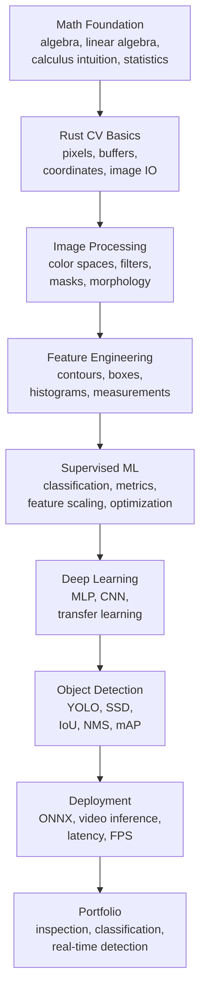

# Roadmap to Become a **Computer Vision Engineer**

This roadmap is organized by chapters, not by days.

The goal is to become practical enough to build, debug, and explain computer vision systems. The focus is Rust-based implementation, image processing, supervised machine learning, CNN image classification, and object detection.

You do not need to go too deep into mathematical proofs or Rust internals. You need enough foundation to reason about images, transformations, models, metrics, and inference pipelines.

---

## Learning Flow Overview

This roadmap moves from numeric image understanding to deployable computer vision systems.



### What You Will Be Able To Build

By following the chapters, you should be able to build:

- Image preprocessing tools: resize, crop, normalize, grayscale, histogram, filters.
- Color-based detection systems: HSV thresholding, mask cleanup, bounding boxes.
- Rule-based inspection systems: object size, shape, color, and defect checks.
- Feature-based classifiers: handcrafted features plus supervised learning.
- Image classification systems: CNN or transfer learning based classifiers.
- Object detection demos: YOLO/SSD style inference with bounding boxes.
- Rust inference applications: image folder inference, video inference, webcam inference.
- Practical reports: metrics, failure cases, latency, FPS, and reproducible commands.

### Career Opportunities After This Roadmap

This path prepares you for practical roles such as:

- Computer Vision Engineer
- AI Engineer focused on vision systems
- Machine Learning Engineer for image data
- Perception Engineer for camera-based systems
- Visual Inspection / Industrial AI Engineer
- Edge AI / Real-time Inference Engineer
- Applied Deep Learning Engineer

The strongest portfolio signal is not knowing every algorithm name. It is showing working systems with clear input/output, measured metrics, visual debugging, and honest failure analysis.

---

## Core Direction

```text
Math for images
-> Rust implementation foundation
-> Image representation and color spaces
-> Filtering, morphology, and masks
-> Feature extraction
-> Supervised machine learning
-> Neural networks
-> CNN image classification
-> Object detection
-> Rust inference and portfolio projects
```

What to prioritize:

- Image processing
- Supervised learning
- CNN-based classification
- Object detection
- Practical Rust inference
- Debugging by visual outputs and metrics

What to de-prioritize:

- Deep mathematical proofs
- Reinforcement learning
- Unsupervised learning as a main track
- Too many architectures without experiments
- Low-level Rust topics that do not help CV work

---

## Chapter 1 - Math Foundation for Computer Vision

### Objective

Build the minimum math foundation first, then apply that math to images.

This chapter should be learned before image processing, color spaces, machine learning, or deep learning. The goal is not to master proofs. The goal is to understand the exact math tools that will later appear in image processing and model training.

### Learning Order

```text
Basic algebra
-> Linear algebra
-> Calculus intuition
-> Basic statistics
-> Apply the math to images with Rust
```

---

### 1. Basic Algebra

You must understand:

- Variables
- Functions
- Linear equation
- Slope
- Ratio
- Percentage
- Range mapping
- Clamping
- Absolute value
- Power and square root

Minimum formulas:

```text
y = ax + b
normalized = (x - min) / (max - min)
scaled = normalized * (new_max - new_min) + new_min
clamped = min(max(value, low), high)
distance_1d = abs(a - b)
```

Why it matters:

- Pixel values are numbers in a fixed range.
- Brightness and contrast are simple algebraic transformations.
- Normalization is used constantly in image pipelines.
- Range mapping appears in grayscale, visualization, preprocessing, and later model input.

Practice with Rust first:

- Implement `clamp(value, low, high)`.
- Implement `normalize(value, min, max)`.
- Implement `map_range(value, old_min, old_max, new_min, new_max)`.
- Implement `abs_diff(a, b)`.
- Write unit tests for edge cases.

Apply to images:

- Convert pixel range `[0, 255]` to `[0.0, 1.0]`.
- Convert normalized values back to `[0, 255]`.
- Implement brightness adjustment.
- Implement contrast adjustment.
- Implement negative image:

```text
new_pixel = 255 - pixel
```

Expected output:

- Brighter image.
- Darker image.
- Higher contrast image.
- Lower contrast image.
- Negative image.

---

### 2. Coordinate Geometry

You must understand:

- 2D coordinate system
- Point `(x, y)`
- Width and height
- Top-left image origin
- Row and column
- Rectangle coordinates
- Distance between two points
- Translation
- Scaling

Minimum formulas:

```text
index = y * width + x
dx = x2 - x1
dy = y2 - y1
distance = sqrt(dx^2 + dy^2)
x_new = x + tx
y_new = y + ty
```

Why it matters:

- Every pixel has a coordinate.
- Cropping, drawing, bounding boxes, and masks depend on coordinates.
- Many bugs in CV code come from mixing up `x/y` and `row/column`.

Practice with Rust first:

- Define a `Point { x, y }`.
- Define a `Rect { x, y, width, height }`.
- Implement `point_distance(a, b)`.
- Implement `contains(rect, point)`.
- Implement `(x, y) -> index`.
- Implement `index -> (x, y)`.

Apply to images:

- Draw one point on an image.
- Draw horizontal and vertical lines.
- Draw a rectangle border.
- Crop an image using rectangle coordinates.
- Translate an image by `(tx, ty)`.

Expected output:

- Image with points.
- Image with lines.
- Image with rectangle.
- Cropped image.
- Translated image.

---

### 3. Linear Algebra

You must understand:

- Scalar
- Vector
- Matrix
- Matrix shape
- Dot product
- Vector norm
- Euclidean distance
- Transpose
- Matrix multiplication
- Identity matrix
- Matrix as transformation

Minimum formulas:

```text
dot(a, b) = sum(a[i] * b[i])
norm(a) = sqrt(sum(a[i]^2))
distance(a, b) = sqrt(sum((a[i] - b[i])^2))
transpose(A)[j][i] = A[i][j]
C[i][j] = sum(A[i][k] * B[k][j])
```

Why it matters:

- RGB color can be treated as a vector `[R, G, B]`.
- Grayscale images can be treated as matrices.
- Color similarity can be measured by vector distance.
- Channel conversion is often a matrix operation.
- Geometric transformation can be expressed with matrices.

Practice with Rust first:

- Implement `dot(a, b)`.
- Implement `norm(a)`.
- Implement `euclidean_distance(a, b)`.
- Implement `transpose(matrix)`.
- Implement `matmul(a, b)`.
- Implement `identity_matrix(n)`.
- Add tests for each function.

Apply to images:

- Treat each RGB pixel as a 3D vector.
- Find pixels close to a target color using vector distance.
- Convert RGB image to grayscale matrix.
- Convert grayscale matrix back to image.
- Flip image horizontally using matrix indexing.
- Flip image vertically using matrix indexing.
- Split RGB channels into separate matrices.
- Merge channel matrices back into RGB.

Expected output:

- Color similarity mask.
- Grayscale image.
- Horizontally flipped image.
- Vertically flipped image.
- Red, green, and blue channel images.
- Reconstructed RGB image.

---

### 4. Calculus Intuition

You must understand:

- Function input and output
- Change in value
- Slope
- Derivative intuition
- Increasing vs decreasing function
- Local change
- Approximation with small differences

Minimum intuition:

```text
slope = change_in_y / change_in_x
small_change = f(x + 1) - f(x)
```

Why it matters:

- Edge detection is based on intensity change.
- A strong edge means pixel values change quickly.
- Gradients in images are local changes in horizontal or vertical direction.
- You do not need formal calculus proofs here, but you need the idea of "how fast something changes".

Practice with Rust first:

- Implement slope between two points.
- Given a list of values, compute neighbor differences.
- Find where a 1D signal changes the most.
- Smooth a 1D signal with a moving average.

Apply to images:

- Compute horizontal intensity difference:

```text
dx = pixel(x + 1, y) - pixel(x, y)
```

- Compute vertical intensity difference:

```text
dy = pixel(x, y + 1) - pixel(x, y)
```

- Create a simple edge map from `abs(dx) + abs(dy)`.
- Compare simple difference edge map with Sobel edge map later.

Expected output:

- Horizontal difference image.
- Vertical difference image.
- Simple edge map.

---

### 5. Basic Statistics

You must understand:

- Count
- Sum
- Mean
- Min / max
- Variance
- Standard deviation
- Histogram
- Distribution intuition
- Outlier

Minimum formulas:

```text
mean = sum(values) / n
variance = sum((x - mean)^2) / n
std = sqrt(variance)
```

Why it matters:

- Mean intensity describes brightness.
- Standard deviation roughly describes contrast.
- Histogram shows how pixel values are distributed.
- Outliers and noise affect thresholds.
- Normalization depends on statistics.

Practice with Rust first:

- Implement `mean(values)`.
- Implement `variance(values)`.
- Implement `std(values)`.
- Implement `min_max(values)`.
- Implement a histogram for values in `0..255`.

Apply to images:

- Compute mean brightness of a grayscale image.
- Compute min and max intensity.
- Compute standard deviation of intensity.
- Build a 256-bin grayscale histogram.
- Apply min-max normalization.
- Compare image statistics before and after contrast adjustment.

Expected output:

- Printed image statistics.
- Histogram data.
- Normalized image.
- Before/after statistics report.

---

### 6. Weighted Sum and Kernels

You must understand:

- Weighted average
- Weighted sum
- Local neighborhood
- Kernel
- Kernel size
- Padding
- Stride
- Convolution as repeated weighted sum

Minimum idea:

```text
output_pixel = sum(neighbor_pixel * kernel_weight)
```

Why it matters:

- Grayscale conversion is a weighted sum of RGB channels.
- Blur is a weighted sum over neighboring pixels.
- Sharpening and edge detection are also kernel operations.
- This is the bridge from math to real image processing.

Practice with Rust first:

- Implement weighted sum over a vector.
- Implement 1D moving average.
- Implement 3x3 weighted sum over a matrix.

Apply to images:

- Implement weighted grayscale:

```text
gray = 0.299 * R + 0.587 * G + 0.114 * B
```

- Implement average grayscale:

```text
gray = (R + G + B) / 3
```

- Implement generic 3x3 convolution.
- Apply box blur.
- Apply sharpen kernel.
- Apply Sobel X.
- Apply Sobel Y.
- Combine Sobel X and Sobel Y into edge magnitude.

Expected output:

- Weighted grayscale image.
- Average grayscale image.
- Blurred image.
- Sharpened image.
- Horizontal edge map.
- Vertical edge map.
- Combined edge map.

---

### 7. Layout and Tensor Thinking

You must understand:

- 1D buffer
- 2D matrix
- 3D image array
- Interleaved RGB
- Planar RGB
- HWC layout
- CHW layout
- Shape validation

Important layouts:

```text
Interleaved RGB:
[R G B][R G B][R G B]...

Planar RGB:
[R R R ...][G G G ...][B B B ...]

HWC:
height, width, channel

CHW:
channel, height, width
```

Why it matters:

- Image files often store pixels in interleaved layout.
- Some processing pipelines prefer planar layout.
- Wrong layout creates wrong colors and broken outputs.

Apply to images:

- Convert interleaved RGB to planar RGB.
- Convert planar RGB back to interleaved RGB.
- Convert HWC to CHW.
- Convert CHW to HWC.
- Verify conversion by reconstructing the image.

Expected output:

- Reconstructed image after layout conversion.
- Unit tests proving layout roundtrip correctness.

---

### Chapter 1 Completion Criteria

You are ready to move on when you can:

- Explain the minimum algebra used in pixel transformations.
- Work with image coordinates correctly.
- Treat RGB pixels as vectors.
- Treat grayscale images as matrices.
- Implement dot product, norm, distance, transpose, and matrix multiplication.
- Understand slope as local change.
- Compute simple image gradients.
- Compute mean, variance, standard deviation, min/max, and histogram.
- Implement grayscale conversion manually.
- Apply a 3x3 kernel.
- Convert between interleaved and planar channel layouts.
- Explain what changed in each output image and why.

---

## Chapter 2 - Rust Foundation for Computer Vision Work

### Objective

Use Rust productively for image and model experiments without spending too much time on unrelated language depth.

### Minimum Rust Knowledge

Focus on:

- `Vec<T>`
- `Vec<Vec<T>>`
- Slices: `&[T]`
- Structs
- `impl`
- `Result`
- `Option`
- `PathBuf`
- Cargo workspace
- Cargo examples
- Unit tests

Practical exercises:

- Create a reusable image-loading helper.
- Create a small matrix utility module.
- Write self-tests for math functions.
- Build one runnable example per concept.
- Print intermediate values while learning.

Expected output:

- Clear Rust examples.
- Small reusable helper functions.
- Unit tests for math and preprocessing logic.

---

## Chapter 3 - Image Representation and Color Spaces

### Objective

Understand how images are stored and choose the right color space for each task.

### Core Topics

Focus on:

- RGB
- BGR
- HSV
- YUV
- YUV420
- NV12
- NV21
- LAB as a bonus
- Grayscale vs color image
- Channel meaning
- Range and normalization
- Raw bytes to image buffer

Why it matters:

- Color filtering depends heavily on color space.
- Camera pipelines often use YUV.
- Many libraries use BGR while image files may use RGB.
- Wrong channel order silently breaks results.

Practical Rust exercises:

- Load an image and inspect width, height, and channel count.
- Convert raw RGB bytes into an image.
- Split RGB channels.
- Convert RGB to HSV manually.
- Visualize H, S, and V channels.
- Convert RGB to YUV.
- Build a simple NV12 or NV21 buffer.
- Save all intermediate outputs.

Expected output:

- RGB channel visualization.
- HSV channel visualization.
- YUV channel visualization.
- Color-space comparison notes.

What to pay attention to:

- RGB vs BGR channel order.
- Hue wrap-around for red.
- Full range vs limited range in YUV.
- UV vs VU order in NV12/NV21.
- Lighting changes can break color thresholds.

---

## Chapter 4 - Color Filtering and Mask Processing

### Objective

Build practical color-based detection pipelines using thresholds, masks, and cleanup operations.

### Core Topics

Focus on:

- Thresholding
- Binary mask
- HSV range selection
- Multi-range thresholding
- Mask overlay
- Morphological transformations
- Erosion
- Dilation
- Opening
- Closing
- Connected components
- Bounding box

Why it matters:

- Many practical CV systems start with segmentation.
- A mask converts pixels into object candidates.
- Morphology turns noisy masks into usable regions.
- Bounding boxes turn masks into measurable detections.

Practical Rust exercises:

- Detect a blue object with HSV thresholds.
- Detect red using two hue ranges.
- Generate a raw binary mask.
- Count mask pixels.
- Overlay mask on the original image.
- Apply opening to remove noise.
- Apply closing to fill holes.
- Find object bounding box from mask pixels.
- Draw a rectangle around the detected object.

Expected output:

- Raw mask image.
- Cleaned mask image.
- Highlighted object image.
- Bounding box output.
- Pixel count logs before and after cleanup.

What to pay attention to:

- Always inspect the raw mask before cleanup.
- Do not tune thresholds on only one image.
- Kernel size must match object size.
- Shadows and reflections often create false positives.
- Mask cleanup should improve object shape, not hide threshold mistakes.

---

## Chapter 5 - Classical Image Processing

### Objective

Learn practical filters and transformations used before ML or deep learning.

### Core Topics

Focus on:

- Grayscale conversion
- Gaussian blur
- Median blur
- Bilateral filter
- Sharpening
- Histogram
- Histogram equalization
- Edge detection
- Sobel
- Canny
- Contour extraction

Why it matters:

- Preprocessing can make a simple system work.
- Bad preprocessing can destroy useful details.
- Edge and contour logic are still useful in inspection systems.

Practical Rust exercises:

- Compare Gaussian vs Median blur on noisy images.
- Run edge detection before and after blur.
- Extract contours from a cleaned mask.
- Measure area, bounding box, aspect ratio, and center point.
- Build a small rule-based inspection demo.

Expected output:

- Filter comparison grid.
- Edge map images.
- Contour and bounding box visualization.
- Rule-based inspection output.

What to pay attention to:

- Gaussian blur reduces noise but softens edges.
- Median blur is useful for salt-and-pepper noise.
- Bilateral filter preserves edges better but costs more.
- Canny thresholds must be tuned per image condition.

---

## Chapter 6 - Feature Extraction

### Objective

Convert images or masks into measurable features that can be used by rules or supervised learning models.

### Core Topics

Focus on:

- Area
- Perimeter
- Bounding box
- Aspect ratio
- Centroid
- Color histogram
- Edge histogram
- HOG concept
- ORB concept

Why it matters:

- Features create strong baselines for simple tasks.
- Feature thinking helps debug deep learning failures later.
- Measurements are often enough for inspection systems.

Practical Rust exercises:

- Extract bounding box from a binary mask.
- Compute object center.
- Compute aspect ratio.
- Compute object area.
- Build a feature vector from shape and color statistics.
- Normalize feature vectors.

Expected output:

- Feature extraction report.
- Object measurement demo.
- Printed feature vectors.

What to pay attention to:

- Features must be stable across lighting, scale, and position.
- Avoid features that only work on one sample image.
- Normalize features before training models.

---

## Chapter 7 - Supervised Machine Learning for Vision

### Objective

Learn the supervised ML concepts needed before neural networks and CNNs.

The focus is supervised learning. Unsupervised learning and reinforcement learning are not the main track.

### Core Topics

Focus on:

- Linear Regression
- Logistic Regression
- Binary Classification
- Multiclass Classification
- Softmax
- Cross Entropy
- Gradient Descent
- Feature Scaling
- Dynamic Learning Rate
- Train / validation / test split
- Classification metrics

Why it matters:

- Logistic Regression and Softmax are the foundation of classifiers.
- Neural networks reuse the same training loop concepts.
- Evaluation discipline matters more than trying many models.

Practical Rust exercises:

- Implement Linear Regression from scratch.
- Implement Logistic Regression from scratch.
- Implement Binary Cross Entropy.
- Implement Softmax.
- Implement Cross Entropy.
- Train a classifier using handcrafted image features.
- Compare training with and without feature scaling.
- Print confusion matrix, precision, recall, and F1.

Expected output:

- Linear Regression demo.
- Logistic Regression demo.
- Softmax classifier demo.
- Evaluation report.

What to pay attention to:

- Data leakage invalidates results.
- Accuracy alone is not enough.
- Scaling affects Gradient Descent strongly.
- Loss decreasing does not always mean the model generalizes.
- Always inspect wrong predictions.

---

## Chapter 8 - Neural Networks

### Objective

Understand neural networks as trainable function approximators before moving into CNNs.

### Core Topics

Focus on:

- Neuron
- Layer
- Weight and bias
- Activation function
- ReLU
- Sigmoid
- Softmax
- Forward pass
- Loss
- Backpropagation intuition
- Overfitting
- Regularization
- Batch training

Why it matters:

- CNNs are neural networks specialized for images.
- Training issues such as overfitting, bad learning rate, and poor normalization appear here first.

Practical Rust exercises:

- Build a small MLP using a Rust ML crate.
- Train on handcrafted image features.
- Compare MLP vs Logistic Regression.
- Log train loss and validation loss.
- Add early stopping logic.

Expected output:

- MLP classifier.
- Training log.
- Validation metric comparison.
- Short error analysis.

What to pay attention to:

- Start with a simple model first.
- If a simple model fails, a bigger model may only hide the real issue.
- Watch validation metrics, not only training loss.

---

## Chapter 9 - CNN and Image Classification

### Objective

Learn image classification with convolutional neural networks and transfer learning.

### Core Topics

Focus on:

- Convolution
- Kernel
- Padding
- Stride
- Pooling
- Feature map
- CNN classifier
- LeNet-5
- VGG
- ResNet
- MobileNet
- Inception
- Transfer learning
- Data augmentation

Priority order:

```text
LeNet-5 for understanding
ResNet for practical accuracy
MobileNet for lightweight inference
VGG for historical understanding
Inception as optional architecture awareness
```

Why it matters:

- Classification is the base skill before object detection.
- Transfer learning is the practical path for many real projects.
- Model choice depends on accuracy, latency, and hardware.

Practical Rust exercises:

- Train a tiny CNN on a small dataset.
- Fine-tune a pretrained classifier.
- Compare ResNet and MobileNet.
- Measure inference latency.
- Save predictions and inspect mistakes.

Expected output:

- Image classification training script.
- Metrics table.
- Failure case gallery.
- Latency measurement.

What to pay attention to:

- Normalize images exactly as the model expects.
- Keep train and validation transforms separate.
- Wrong augmentation can hurt performance.
- MobileNet is often better when deployment speed matters.

---

## Chapter 10 - Object Detection

### Objective

Move from classifying whole images to locating objects inside images.

### Core Topics

Focus on:

- Bounding box
- IoU
- Confidence score
- Class probability
- Non-Max Suppression
- Precision / Recall for detection
- mAP
- SSD
- YOLO
- Detection dataset annotation

Why it matters:

- Object detection is one of the most job-relevant CV skills.
- Real projects often need both accuracy and real-time inference.
- Annotation quality often matters more than model tweaking.

Practical Rust exercises:

- Parse bounding box annotations.
- Implement IoU.
- Implement simple NMS.
- Run inference with a pretrained YOLO or SSD model.
- Draw detected boxes on images.
- Run detection on video or webcam.
- Tune confidence and NMS thresholds.

Expected output:

- Object detection inference demo.
- Annotated output images.
- Video or webcam demo.
- Metrics and FPS report.

What to pay attention to:

- Bad labels cap performance.
- False positives and false negatives need separate analysis.
- A model that works on curated images may fail in real lighting.
- Threshold tuning is scenario-specific.

---

## Chapter 11 - Rust Inference and Deployment

### Objective

Build usable Rust applications that run computer vision models reliably.

### Core Topics

Focus on:

- Image preprocessing pipeline
- Tensor layout
- NCHW vs NHWC
- RGB vs BGR
- Batch dimension
- ONNX Runtime
- OpenCV video capture
- FPS measurement
- Latency measurement
- Postprocessing

Why it matters:

- A Computer Vision Engineer must move beyond notebooks.
- Deployment bugs often come from preprocessing mismatch.
- Rust is useful for building fast and reliable inference tools.

Practical Rust exercises:

- Load an ONNX model.
- Preprocess an image into the exact input tensor format.
- Run inference.
- Decode output.
- Draw predictions.
- Run on a folder of images.
- Run on video or webcam.
- Measure average latency and FPS.

Expected output:

- Rust image inference CLI.
- Rust video inference demo.
- Reproducible run commands.
- Latency/FPS report.

What to pay attention to:

- Match training preprocessing exactly.
- Check channel order.
- Check tensor shape.
- Check normalization.
- Time preprocessing, inference, and postprocessing separately.

---

## Chapter 12 - Portfolio Projects

### Objective

Turn learning into evidence that you can build practical CV systems.

### Project 1 - Color-Based Object Inspection

Build a rule-based inspection system using:

- Color space conversion
- HSV thresholding
- Mask cleanup
- Bounding box extraction
- Area/aspect-ratio rules
- Failure analysis

Expected output:

- Input images.
- Raw masks.
- Cleaned masks.
- Final annotated outputs.
- Short report explaining thresholds, failure cases, and improvements.

### Project 2 - Image Classification System

Build an image classifier using:

- Dataset split
- Preprocessing
- Transfer learning
- Metrics
- Error analysis
- Rust inference

Expected output:

- Training results.
- Confusion matrix.
- Wrong prediction gallery.
- Rust inference command.

### Project 3 - Object Detection System

Build an object detector using:

- Labeled dataset
- YOLO or SSD workflow
- Detection metrics
- NMS threshold tuning
- Rust video inference

Expected output:

- Detection demo.
- mAP or practical metric report.
- FPS report.
- False positive / false negative analysis.

---

## Practical Study Loop

Use this loop for every chapter:

```text
1. Learn only the minimum theory.
2. Implement the smallest working version in Rust.
3. Save visual or metric output.
4. Break the pipeline intentionally and observe failure.
5. Fix the failure and document the rule.
6. Reuse the module in a more realistic task.
```

---

## Skill Checklist

### Math and Image Basics

- [ ] Convert pixels between `u8` and `f32`.
- [ ] Normalize and clamp pixel values.
- [ ] Work with image coordinates safely.
- [ ] Treat grayscale images as matrices.
- [ ] Treat RGB pixels as vectors.
- [ ] Split and merge image channels.
- [ ] Apply 3x3 convolution kernels.
- [ ] Compute image statistics and histograms.
- [ ] Perform basic geometric transformations.

### Image Processing

- [ ] Understand RGB, HSV, YUV, and LAB use cases.
- [ ] Build stable color thresholding pipelines.
- [ ] Clean masks with morphology.
- [ ] Extract bounding boxes and object measurements.
- [ ] Debug lighting, reflection, and noise issues.

### Supervised Machine Learning

- [ ] Implement Linear Regression.
- [ ] Implement Logistic Regression.
- [ ] Implement Softmax classification.
- [ ] Understand Gradient Descent and learning rate.
- [ ] Use feature scaling correctly.
- [ ] Evaluate with precision, recall, F1, and confusion matrix.

### Deep Learning

- [ ] Understand CNN basics.
- [ ] Train or fine-tune an image classifier.
- [ ] Compare ResNet and MobileNet.
- [ ] Use augmentation correctly.
- [ ] Track loss curves and validation metrics.

### Object Detection

- [ ] Understand IoU and NMS.
- [ ] Run pretrained detection inference.
- [ ] Fine-tune or use YOLO/SSD workflow.
- [ ] Analyze false positives and false negatives.
- [ ] Build real-time Rust inference.

### Engineering

- [ ] Keep reproducible commands.
- [ ] Write focused docs for every experiment.
- [ ] Add tests for math and preprocessing functions.
- [ ] Save visual outputs for debugging.
- [ ] Measure latency and FPS for inference.

---

## Final Priority Order

If time or energy is limited, focus in this order:

```text
1. Math applied directly to images
2. Image preprocessing robustness
3. Supervised ML fundamentals
4. CNN image classification
5. Object detection inference
6. Deployment and portfolio polish
```

The main target is not to know every algorithm deeply. The main target is to build reliable computer vision pipelines, understand the failure modes, and explain engineering decisions clearly.
